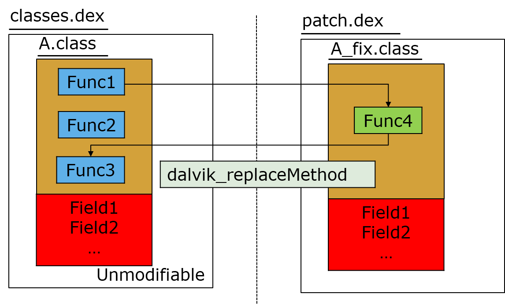
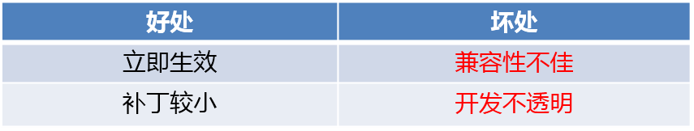

# AndroidHotFixComopare
对比几个Android热修复框架,其中包括[Nuwa(大众点评)](https://github.com/jasonross/Nuwa),[AndFix(阿里巴巴)](https://github.com/alibaba/AndFix),[RocooFix](https://github.com/dodola/RocooFix)

##At First
Android热修复方案主要包括Dexpose，AndFix， QZone方案，Tinker(QZone方案更进一步)
其中阿里的Dexposed的不支持ART，所以不做商业化考虑。
微信团队的Tinker没有开源，只有基本的实现原理，具体实现也比较复杂，所以也不做考虑。
此项目主要演示了阿里的AndFix以及基于Qzone方案实现的Nuwa和RocooFix框架

##下面是几种方案的具体实现介绍
###AndFix
AndFix采用native hook的方式，这套方案直接使用dalvik_replaceMethod替换class中方法的实现。由于它并
没有整体替换class, 而field在class中的相对地址在class加载时已确定，所以AndFix无法支持新增或者删除
filed的情况(通过替换init与clinit只可以修改field的数值)。

也正因如此，Andfix可以支持的补丁场景相对有限，仅仅可以使用它来修复特定问题。
另一方面，使用native替换将会面临比较复杂的兼容性问题。

相比其他方案，AndFix的最大优点在于立即生效。事实上，AndFix的实现与Instant Run的热插拔有点类似

###QZone
QZone方案并没有开源，但在github上有几个采用此原理实现的开源方案，其中包括Nuwa和RocooFix。
这个方案使用classloader的方式，能实现更加友好的类替换。而且这与我们加载Multidex的做法相似，能基本保证稳定性与兼容性。具体原理在这里不再细说，大家可以[参考这篇文章](https://mp.weixin.qq.com/s?__biz=MzI1MTA1MzM2Nw==&mid=400118620&idx=1&sn=b4fdd5055731290eef12ad0d17f39d4a&scene=1&srcid=1106Imu9ZgwybID13e7y2nEi#wechat_redirect)。

###Tinker
Zone方案采用插桩导致对程序运行时的性能产生影响，所以微信的Tinker方案为了解决unexpected DEX problem有研究出来另一套方案，主要原理就是重新替换全新的Dex，如果采用全新的那样既不出现Art地址错乱的问题，在Dalvik也无须插桩。当然如果全新的Dex补丁包就会比较大，所以微信就研究出一个算法使用旧的Dex和新旧Dex的差异生成全新的Dex

###比较
图片来自[微信Tinker](http://bugly.qq.com/bbs/forum.php?mod=viewthread&tid=1264&extra=page%3D1)
